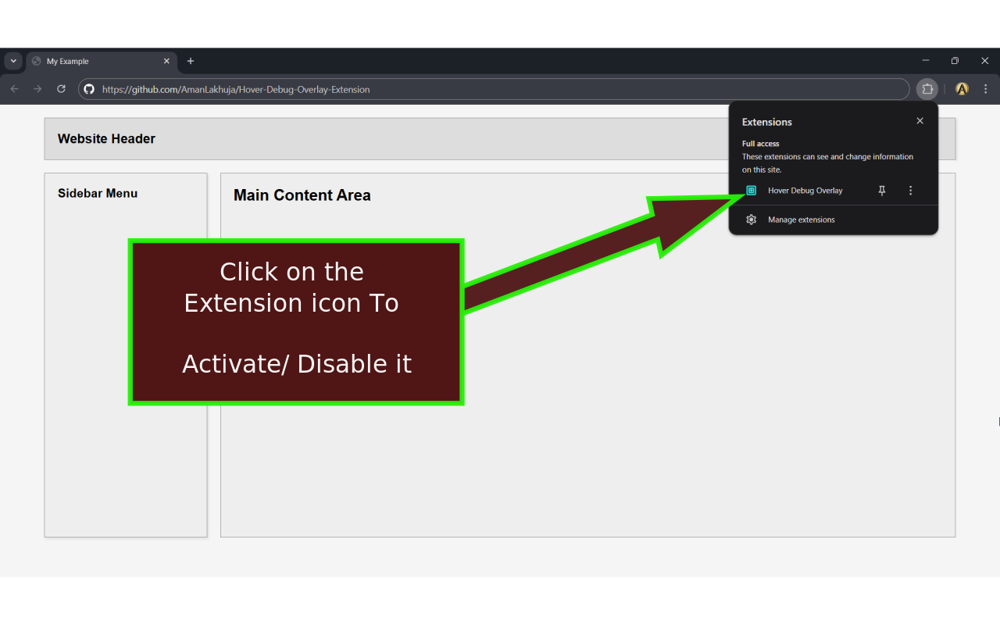
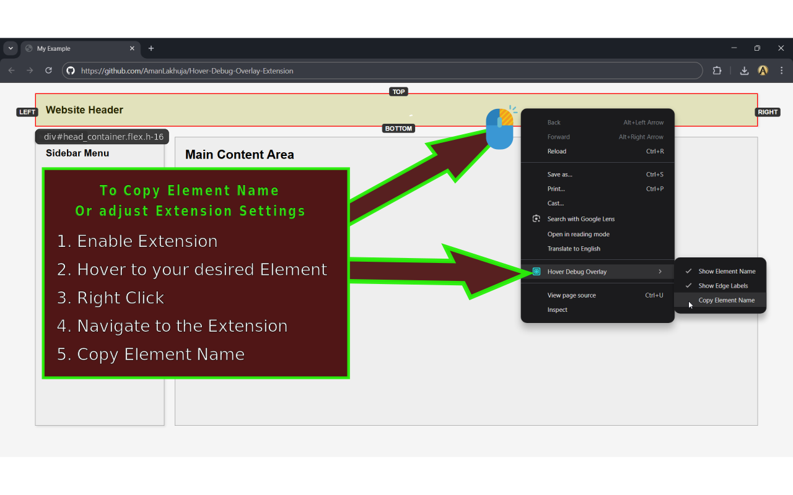

# Hover Debug Overlay Extension 

This document provides a detailed overview of the Hover Debug Overlay Chrome extension, including its features, installation steps, and usage instructions.

## 1. Introduction

* The Hover Debug Overlay is a lightweight and powerful Chrome extension designed to assist developers and designers in inspecting the dimensions and properties of web page elements. 

* By simply hovering over an element, the extension displays a live, interactive overlay that shows the element's boundaries and key information without disrupting the page layout.

* Have The Ability to copy some Tailwind CSS element properties

---

## 2. Tutorial 

* Screenshot 1


* Screenshot 2


* Tutorial Video :- [Video-Guide](./screenshots_tutorial/Tutorial_Hover_Debug_Overlay_Extension_no_audio.mp4)

<video width=100% controls>
  <source src="./screenshots_tutorial/Tutorial_Hover_Debug_Overlay_Extension_no_audio" type="video/mp4">
</video>

---


## 2. Features

* **Live Dimension Overlay:** Displays a semi-transparent overlay with TOP, LEFT, RIGHT, and BOTTOM labels to show an element's boundaries in real-time.

* **Element Descriptor:** Shows the element's tag name, ID, and class names (e.g., div#main.container).

* **Toggle On/Off:** The extension can be easily activated or deactivated with a single click on the browser's toolbar icon.

* **Right-Click Context Menu:** Provides quick access to settings and functionality directly from the page.

* **Show Element Name:** Toggles the visibility of the element's descriptor. This is enabled by default.

* **Show Edge Labels:** Toggles the visibility of the TOP, LEFT, RIGHT, and BOTTOM labels. This is enabled by default.

* **Copy Element Name:** Copies the element's descriptor to the clipboard from the exact location of the right-click. This prevents accidental copying of the wrong element when the mouse moves.

* **State Management:** The extension's state (active/inactive, settings) is persisted across tabs and browser sessions using chrome.storage.local. The overlay is automatically disabled when you switch tabs or lose browser focus to prevent unexpected behavior.

* **No Popup:** The extension operates without a popup, offering a faster and more direct user experience. All controls are handled via the main toolbar icon and the right-click context menu.

* Remembers your settings using local storage

* No data collection, no remote requests, no analytics


---

## 3. Installation


#### 1.  Method 1 :- Add it directly to your Browser Extentions

* Click on this link and Click "Add to Chrome" :-  [Hover Debug Overlay](https://chromewebstore.google.com/detail/hover-debug-overlay/dnhkakioabglpfiidamfmijkdncgmajo)

#### 2. Method 2 :- Searching it in Chrome Webstore

* Go To [Chrome Webstore Extensions](https://chromewebstore.google.com/category/extensions) and Search **`Hover Debug Overlay`** and Click on "Add to Chrome"

#### 3. Method 3 :- To Download From Github and use it Locally

* Clone or download the extension's source code from the repository.

* Go To Chrome --> Settings --> Extensions --> Enable Developer mode by toggling the switch in the top-right corner.

* Then Click the "Load unpacked" button.

* Select the extension's folder (the directory containing manifest.json).

* The extension icon will now appear in your browser's toolbar.

---

## 4. Usage

* To Enable/Disable the Overlay: Click the extension's icon in the toolbar.

* To View Element Information: Once the extension is active, hover your mouse over any element on a web page. The overlay and labels will appear.

* To Adjust Settings: Right-click anywhere on the web page to open the context menu. The options "Show Element Name" and "Show Edge Labels" can be toggled on or off from this menu.

* To Copy Element Name and Details :- Right-click the desired element and select the "Copy Element Name" option from the context menu. The element's descriptor (e.g., div#header.logo) will be copied to your clipboard.

---

## 5. Technical Details

* `manifest.json:` Defines the extension's properties, permissions (scripting, activeTab, storage, contextMenus, clipboardWrite), and icon paths.

* `background.js:` The service worker that manages the extension's state, handles icon clicks, creates context menu items, and communicates with the content.js script. It also manages state changes when tabs or windows are switched.

* `content.js:` The script that is injected into the active tab when the extension is enabled. It handles the mousemove and contextmenu events to create, update, and manage the visual overlay on the web page. This script also contains logic to prevent duplicate overlays and ensures a single, clean instance is always running.

* `Icons:` The extension uses SVG icons for all display contexts, including the toolbar, chrome://extensions/ page, and context menu.

---

## 6. File Structure

```bash
Hover_Debug_Overlay_Extension/
│ 
├──/hover-debug-overlay-v-1.1/
│   ├── manifest.json
│   ├── background.js
│   ├── content.js
│   ├── icon16.png
│   ├── icon32.png
│   ├── icon48.png
│   ├── icon128.png
│   └── PRIVACY.md
│
├── LICENSE
├── README.md
└── screenshots_tutorial/
    ├── Tutorial_Hover_Debug_Overlay_Extension.mp4
    ├── Tutorial_Hover_Debug_Overlay_Extension_no_audio.mp4
    ├── icon48.png
    ├── Screenshot_1_1280x800.png
    ├── Screenshot_2_1280x800.png
    ├── Screenshot_3_1280x800.png
    ├── Screenshot_4_1280x800.png
    └── Marquee_Promo_Tile.png
```


---

[](https://chromewebstore.google.com/detail/hover-debug-overlay/dnhkakioabglpfiidamfmijkdncgmajo)

---
